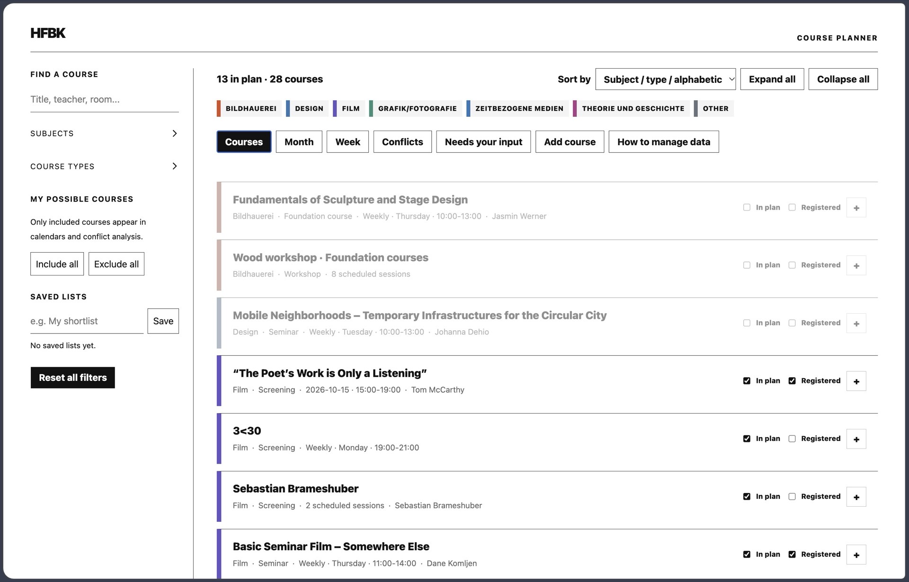
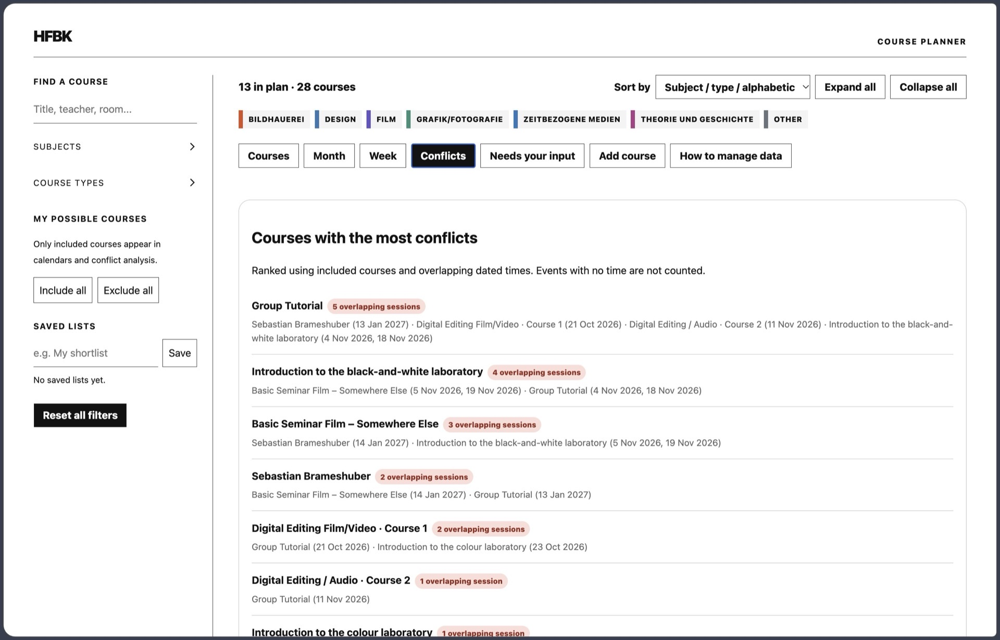

# HFBK Course Planner

A bilingual course planner with list, month, week, conflict, and missing-information views. Everything runs in the browser. Course data is not sent to a server.

This is an independent project and is not an official HFBK service.

 

## Features

- English and German course descriptions
- Collapsible course, subject, and course-type sections
- Monthly and hourly weekly calendars
- Subject colours, saved filters, plan status, and registration status
- Conflict ranking for selected courses
- Guided course entry with exact or repeating dates, including break dates
- Course editing from the overview
- Automatic checks for missing or malformed course information
- JSON import and export

Subjects use the eight official HFBK study focuses plus **Other**. Course types use a short list of teaching formats so filters stay consistent.

## Open a Node session

Docker is the only local requirement. Start an interactive Node container from the project directory:

```sh
docker run --rm -it \
  -p 4173:4173 \
  -v "$PWD:/app" \
  -v /app/node_modules \
  -w /app \
  node:22-alpine sh
```

Commands in the following sections run inside this container. Install the locked dependencies once:

```sh
npm ci
```

## Start the development server

```sh
npm run dev -- --port=4173
```

Open <http://localhost:4173>. Press `Ctrl+C` to stop the server and return to the container shell.

## Add course data

Copy [data.example.json](data.example.json) to `data/data.json`, then replace the example course with your own entries. The `data/` directory is ignored by Git.

You can also open **How to manage data** in the app and choose a JSON file. A JSON file is a text document with labelled fields for information such as titles, dates, rooms, and teachers.

Imported data, added courses, and edits stay in the current browser session. Plan and registration choices are stored in local browser storage. Export the JSON if you want to keep those changes in a file.

Export and save the current JSON before closing the session or reloading the page to preserve added courses, edits, and plan or registration changes.

## Build

```sh
npm run build
```

This runs TypeScript first, then writes the static site to `dist/`. Production builds never include `data/data.json`. Visitors provide their own file through the upload view.

## Code quality

Run formatting, ESLint, and TypeScript together with:

```sh
npm run check
```

Format the source with `npm run format`.

## Publishing

The GitHub Pages workflow uses the standard Node action, installs dependencies once, builds the application, and deploys `dist/`. Formatting and linting are separate non-blocking warning steps. TypeScript errors and build failures block publication. The workflow does not publish personal course data.

## License

[MIT](LICENSE)
